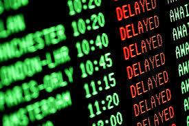

# Flight Delay Prediction - Using Machine Learning Algorithms 

# Overview 
Over the last two decades, the popularity of air travel has increased significantly among travelers, mostly because of its speed in comparison to other modes of transportation. This has led to increase in traffic in the air and on the ground, which further has resulted in massive levels of aircraft delays [1]. Flight delays cost billions of dollars and have a huge impact on the US economy, causing a stain on the air travel system, passengers and society [2]. 

In this Capstone project my aim is to apply machine learning algorithms like decision tree, random forest and logistic regression to predict flight delays. I will train the models on one dataset and test on another, to check the accuracy of the models in predicting the flight delays. 

# Repository Navigation 

Table of Contents -

EDA Notebook               : [Notebook](Notebook/eda_phase1.ipynb)

Report       : [Link](https://sites.google.com/umbc.edu/data606/spring-2021-section-1/sana-sharma?authuser=0)

Presentation Phase 1      : [PowerPoint](https://drive.google.com/file/d/1zIyrIUfUie7ceeJ0vsogHz07Q7NRyv5z/view?usp=sharing)

Presentation Phase 2      : [PowerPoint](https://drive.google.com/file/d/12y9ae-DkaJI4pXcGxMU3jtgcqvAnvbuP/view?usp=sharing)

Presentation Phase 3      : [PowerPoint](https://drive.google.com/file/d/1jdAvQWvtvjlNeS35OGU8_ihLal8fy5eI/view?usp=sharing)

# Data Description

The datasets I am using were acquired from United States Department of Transportation’s (DOT) Bureau of Transportation Statistics (BTS) website. BTS tracks the on-time performance of domestic flights operated by large air carriers. It provides datasets that are focused on the number of on-time, delayed, canceled and diverted flights that appear in DOT's monthly Air Travel Consumer Report, published about 30 days after the month's end. The website contains data starting from June 2003 till November 2020 [3]. 

For my analysis, I will use 5 datasets. All 5 datasets contain the same fields but represent different time slices. I will use 4 datasets for Phase 1 & 2 for Exploratory Data Analysis and Training my models. For Phase 3, I will use the 5th dataset to test my models on and check their accuracies. These datasets contain flight delay statistics ranging from January 2015 – January 2019. After concatenating January 2015 – January 2018 datasets into 1 dataframe, the dataset includes 1,935,930 rows and 51 columns for my Phase 1 & 2 analysis. After further exploration of the data on the BTS website, I have decided to use 29 out of the 51 columns for my analysis [4] –

1.	YEAR – Year                 
2.	DAY_OF_MONTH – Day of the Month
3.	DAY_OF_WEEK – Day of the Week         
4.	FL_DATE – Flight Date (yyyymmdd)            
5.	OP_UNIQUE_CARRIER – Reporting Airline
6.	ORIGIN – Origin Airport             
7.	ORIGIN_WAC – Origin Airport, World Area Code                   
8.	DEST – Destination Airport                        
9.	DEST_WAC – Destination Airport, World Area Code                   
10.	DEP_TIME – Actual Departure Time (local time: hhmm)                              
11.	DEP_DELAY – Difference in minutes between scheduled and actual departure time. Early departures show negative numbers 
12.	DEP_DEL15 – Departure Delay Indicator, 15 Minutes or More (1=Yes)
13.	TAXI_OUT – Taxi out Time, in Minutes           
14.	TAXI_IN – Taxi in Time, in Minutes         
15.	WHEELS_OFF – Wheels Off Time (local time: hhmm)
16.	WHEELS_ON – Wheels on Time (local time: hhmm)       
17.	ARR_TIME – Actual Arrival Time (local time: hhmm)                  
18.	ARR_DELAY – Difference in minutes between scheduled and actual arrival time. Early arrivals show negative numbers
19.	ARR_DEL15 – Arrival Delay Indicator, 15 Minutes or More (1=Yes)
20.	CANCELLED – Cancelled Flight Indicator (1=Yes)    
21.	CANCELLATION_CODE – Specifies the Reason for Cancellation
22.	DIVERTED – Diverted Flight Indicator (1=Yes)     
23.	AIR_TIME – Flight Time, in Minutes       
24.	DISTANCE – Distance between airports (miles)           
25.	CARRIER_DELAY – Carrier Delay, in Minutes  
26.	WEATHER_DELAY – Weather Delay, in Minutes
27.	NAS_DELAY – National Air System Delay, in Minutes         
28.	SECURITY_DELAY – Security Delay, in Minutes   
29.	LATE_AIRCRAFT_DELAY – Late Aircraft Delay, in Minutes

I plan to dive a bit deeper by the next delivery deadline analyzing details about the types of questions I have in the dataset and complete my Exploratory Data Analysis.

# Implementation Details
The aim of this Capstone project is to predict flight delays using machine learning algorithms like decision tree, random forest and logistic regression. Thus, I chose 29 out of 51 features out of which, some are usually known in advance like – Day, Day of the week, Carrier, Origin airport, Destination Airport, Scheduled departure, Departure delay, taxi-out/in, Distance, Scheduled arrival etc.
 
My plan is to train the models on one dataset and test on another, to check the accuracy of the models in predicting flight delays. 

1. Data Cleaning and Exploratory Data Analysis (EDA) –
I will use Pandas, Matplotlib, NumPy and Seaborn libraries, to name a few for my initial EDA. I will also use Tableau to create a data story with interactive visuals that provide useful insights to anyone viewing them.

2. Machine Learning – 
I will be using decision tree, random forest and logistic regression to predict flight delays. To apply the algorithms, I will use SciKit-Learn library in Python for testing and training and SK-Learn library to import all the methods of classification algorithms. After training my models on January 2015 – January 2018 dataset, I will test the models on the January 2019 dataset. And finally, can also use Confusion Matrix to check the accuracy as confusion matrix is a way of tabulating the number of misclassifications.

# Project Info & Software Requirements
Capstone Project - Sana Sharma

Languages    : Python 2.7

Tools/IDE    : Google Collab

Libraries    : pandas, matplotlib, statsmodels, sklearn, seaborn
